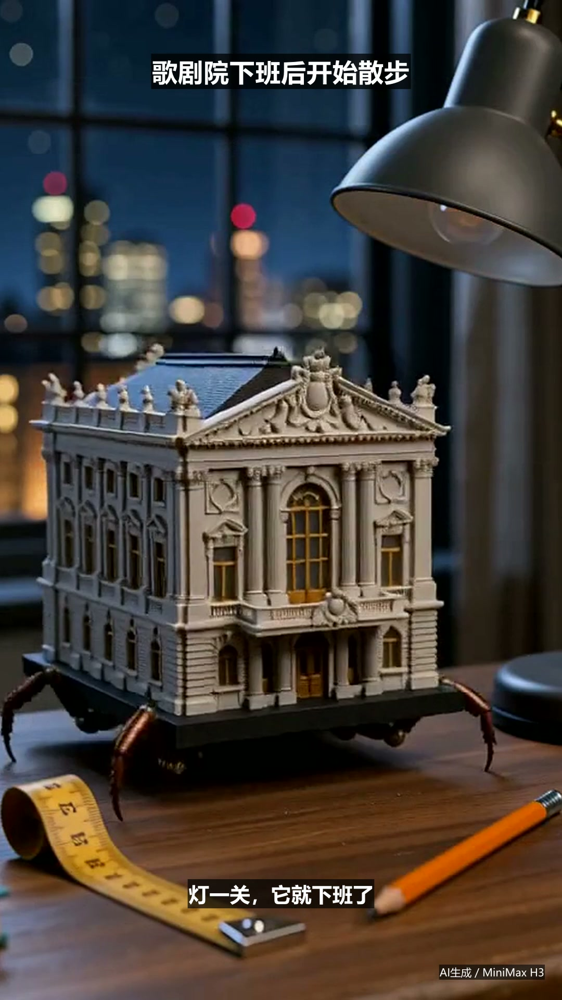
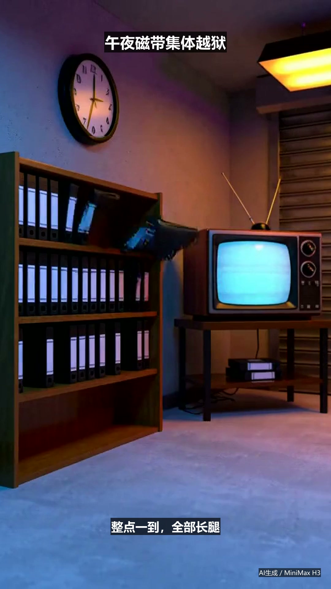

# 两支 MiniMax H3 完整试片

两支作品均由本机 MiniMax H3 文生音视频生成，随后以可复现的 FFmpeg 流水线完成 1080×1920 竖屏包装、中文字幕、AI标识、色彩微调、音频响度/峰值控制、H.264/AAC 编码与封面导出。

## V2-191｜歌剧院下班后开始散步

- [播放/下载 MP4](V2-191-walking-opera/V2-191_final.mp4)
- [生成与剪辑清单](V2-191-walking-opera/manifest.json)
- [H3提示词](V2-191-walking-opera/prompt.txt)

## V2-193｜午夜录像带从货架集体越狱

- [播放/下载 MP4](V2-193-tape-escape/V2-193_final.mp4)
- [生成与剪辑清单](V2-193-tape-escape/manifest.json)
- [H3提示词](V2-193-tape-escape/prompt.txt)

原始H3草稿保存在本地 `production/`，不进入Git历史；最终成片、封面、字幕、提示词与SHA-256来源记录均纳入仓库。
